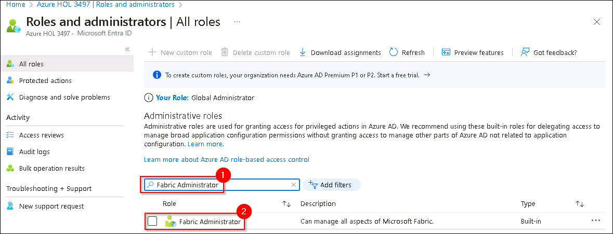
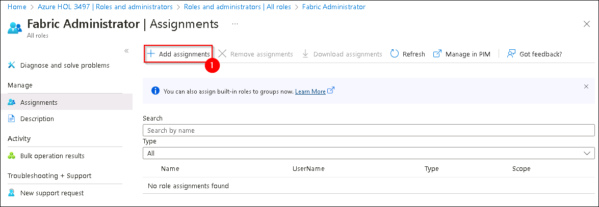
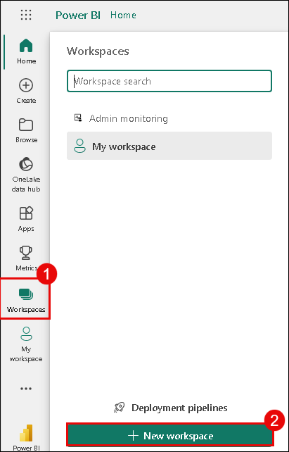
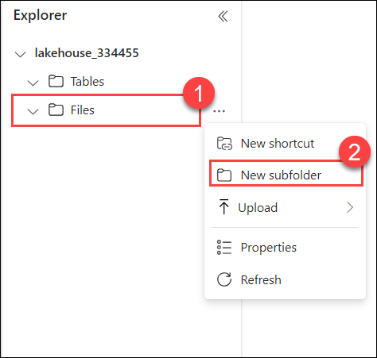
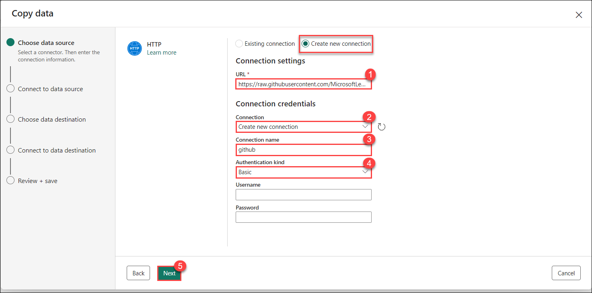
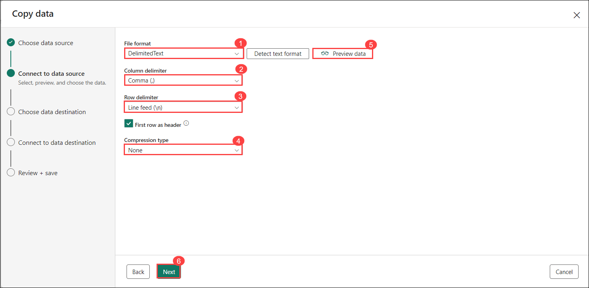
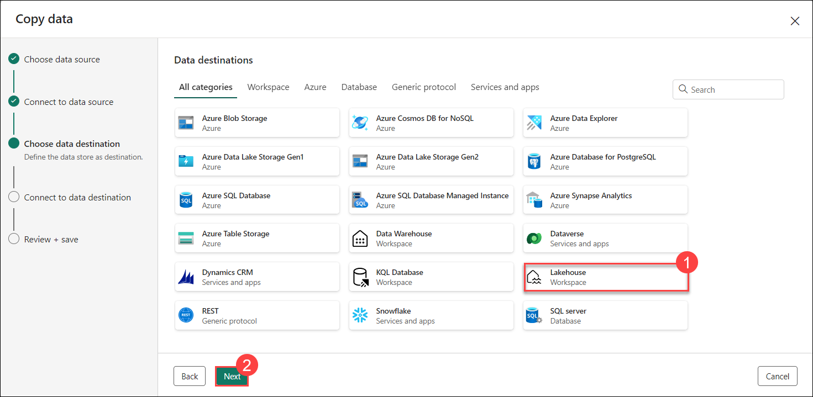
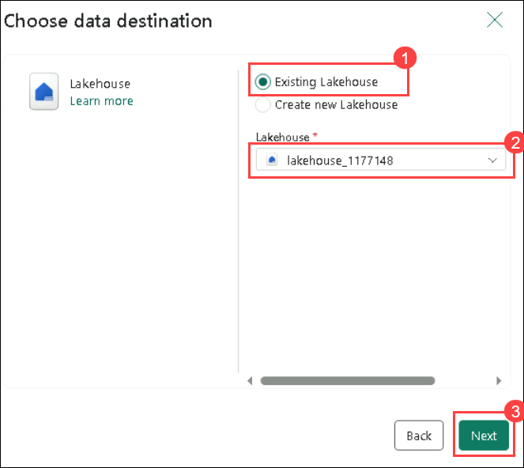
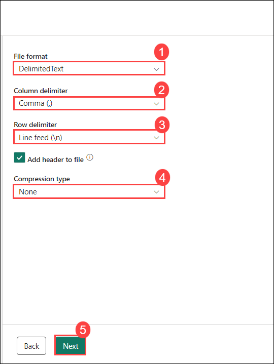
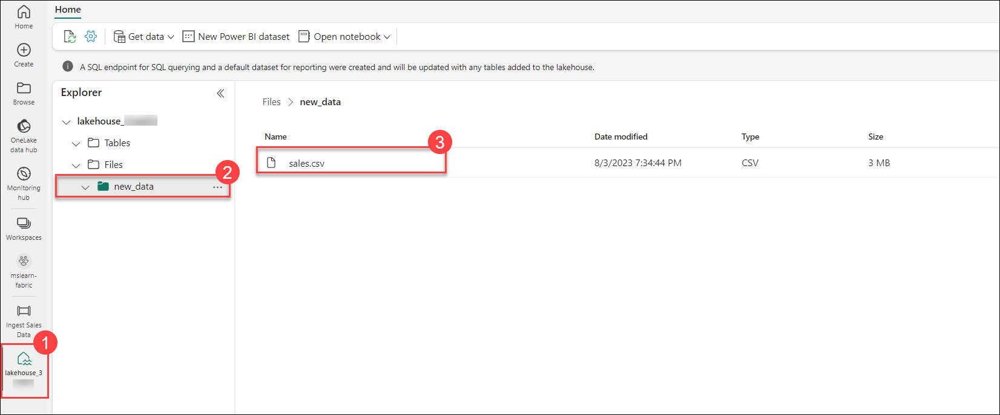

### Create a Fabric workspace


#### Task 1.1: Assign Fabric Administrator Role

1. Start by searching for **Microsoft Entra ID** in the search pane in Azure portal:

   

2. Navigate to **Roles and administrators**:

   

3. In the **Roles and administrators** page, search for **Fabric Administrator**, and click on it:

   

4. This will take you to the **Fabric Administrator | Assignments** page where you will have to assign yourself the **Fabric Administrator role**. Now, click on **+ Add Assignments**:

   

5. Make sure to **check the box(1)** next to your username, confirm if it is **Selected(2)** and click on **Add(3)**:

   

6. You can confirm the **Fabric Administrator** role has been added successfully by **refreshing(1)** Fabric Administrators | Assignments page. After **confirming(2)** it has been added successfully, navigate back to **Home(3)**.

   

----

#### Task 1.2: Sign up for Microsoft Fabric Trial

1. Copy the **microsoft fabric homepage link**, and open this link inside the VM in a new tab:

   ```
   https://app.fabric.microsoft.com/
   ```


2. Select **Power BI**.

   

#### Task 1.3: Create a workspace

Here, you create a Fabric workspace. The workspace contains all the items needed for this lakehouse tutorial, which includes lakehouse, dataflows, Data Factory pipelines, the notebooks, Power BI datasets, and reports.

1.  Now, select **Workspaces** and click on **+ New workspace**:

    

2. Fill out the **Create a workspace** form with the following details:

   - **Name:** Enter **fabric-<inject key="DeploymentID" enableCopy="false"/>**.
   

   

   - **Advanced:** Expand it and Under **License mode**, select **Fabric capacity(1)**.

3. Select on exisitng **Capacity(2)** then click on **Apply(3)** to create and open the workspace.

   

# Ingest data with a pipeline in Microsoft Fabric

A data lakehouse is a common analytical data store for cloud-scale analytics solutions. One of the core tasks of a data engineer is to implement and manage the ingestion of data from multiple operational data sources into the lakehouse. In Microsoft Fabric, you can implement *extract, transform, and load* (ETL) or *extract, load, and transform* (ELT) solutions for data ingestion through the creation of *pipelines*.

Fabric also supports Apache Spark, enabling you to write and run code to process data at scale. By combining the pipeline and Spark capabilities in Fabric, you can implement complex data ingestion logic that copies data from external sources into the OneLake storage on which the lakehouse is based, and then uses Spark code to perform custom data transformations before loading it into tables for analysis.

This lab will take approximately **60** minutes to complete.


## Create a Lakehouse

Large-scale data analytics solutions have traditionally been built around a *data warehouse*, in which data is stored in relational tables and queried using SQL. The growth in "big data" (characterized by high *volumes*, *variety*, and *velocity* of new data assets) together with the availability of low-cost storage and cloud-scale distributed compute technologies has led to an alternative approach to analytical data storage; the *data lake*. In a data lake, data is stored as files without imposing a fixed schema for storage. Increasingly, data engineers and analysts seek to benefit from the best features of both of these approaches by combining them in a *data lakehouse*; in which data is stored in files in a data lake and a relational schema is applied to them as a metadata layer so that they can be queried using traditional SQL semantics.

In Microsoft Fabric, a lakehouse provides highly scalable file storage in a *OneLake* store (built on Azure Data Lake Store Gen2) with a metastore for relational objects such as tables and views based on the open source *Delta Lake* table format. Delta Lake enables you to define a schema of tables in your lakehouse that you can query using SQL.


Now that you have created a workspace in the previous step, it's time to switch to the *Data engineering* experience in the portal and create a data lakehouse into which you will ingest data.

1. At the bottom left of the Power BI portal, select the **Power BI** icon and switch to the **Data Engineering** experience.

   
   
2. In the **Data engineering** home page, create a new **Lakehouse**.

    - **Name:** Enter **Lakehouse_<inject key="DeploymentID" enableCopy="false"/>**.

   

    After a minute or so, a new lakehouse with no **Tables** or **Files** will be created.

4. On the **Lake view** tab in the pane on the left, in the **...** menu for the **Files** node, select **New subfolder** and create a subfolder named **new_data**.

   

## Explore shortcuts

In many scenarios, the data you need to work with in your lakehouse may be stored in some other location. While there are many ways to ingest data into the OneLake storage for your lakehouse, another option is to instead create a *shortcut*. Shortcuts enable you to include externally sourced data in your analytics solution without the overhead and risk of data inconsistency associated with copying it.

1. In the **...** menu for the **Files** folder, select **New shortcut**.
2. View the available data source types for shortcuts. Then close the **New shortcut** dialog box without creating a shortcut.


## Create a pipeline

A simple way to ingest data is to use a **Copy Data** activity in a pipeline to extract the data from a source and copy it to a file in the lakehouse.

1. On the **Home** page for your lakehouse, select **New Data pipeline**.

    

2. Create a new data pipeline named **Ingest Sales Data Pipeline**. 
   
   
   
3. If the **Copy Data** wizard doesn't open automatically, select **Copy Data** in the pipeline editor page.

   

4. In the **Copy Data** wizard, on the **Choose a data source** page, in the **data sources** section, select the **Generic protocol (1)** tab and then select **HTTP (2)**, click on **Next (3)**.

   

5. Select **Next** and then select **Create new connection** and enter the following settings for the connection to your data source:
    - **URL**: `https://raw.githubusercontent.com/MicrosoftLearning/dp-data/main/sales.csv`
    - **Connection**: Create new connection
    - **Connection name**: *Specify a unique name*
    - **Authentication kind**: Basic (*Leave the username and password blank*)
  
    
    
6. Select **Next**. Then ensure the following settings are selected:
    - **Relative URL**: *Leave blank*
    - **Request method**: GET
    - **Additional headers**: *Leave blank*
    - **Binary copy**: <u>Un</u>selected
    - **Request timeout**: *Leave blank*
    - **Max concurrent connections**: *Leave blank*
  
    
   
8. Select **Next**, and wait for the data to be sampled and then ensure that the following settings are selected:
    - **File format**: DelimitedText
    - **Column delimiter**: Comma (,)
    - **Row delimiter**: Line feed (\n)
    - **First row as header**: Selected
    - **Compression type**: Leave default
9. Select **Preview data** to see a sample of the data that will be ingested. Then close the data preview and select **Next**.

     

10. On the **Choose data destination** page, select your existing lakehouse. Then select **Next**.

     

     

12. Set the following data destination options, and then select **Next**:
    - **Root folder**: Files
    - **Folder path name**: new_data
    - **File name**: sales.csv
    - **Copy behavior**: Leave default
   
    

13. Set the following file format options and then select **Next**:
    - **File format**: DelimitedText
    - **Column delimiter**: Comma (,)
    - **Row delimiter**: Line feed (\n)
    - **Add header to file**: Selected
    - **Compression type**: Leave default
   
    

14. On the **Copy summary** page, review the details of your copy operation and then select **Review + Run**.

    A new pipeline containing a **Copy Data** activity is created, as shown here:

    

15. When the pipeline starts to run, you can monitor its status in the **Output** pane under the pipeline designer. Use the **&#8635;** (*Refresh*) icon to refresh the status, and wait until it has succeeded.

    

16. In the menu bar on the left, select your lakehouse.

17. On the **Home** page, in the **Lakehouse explorer** pane, expand **Files** and select the **new_data** folder to verify that the **sales.csv** file has been copied.

    

    **Congratulations!** You have successfully learnt to create a Fabric workspace.

   ## Proceed to next exercise
