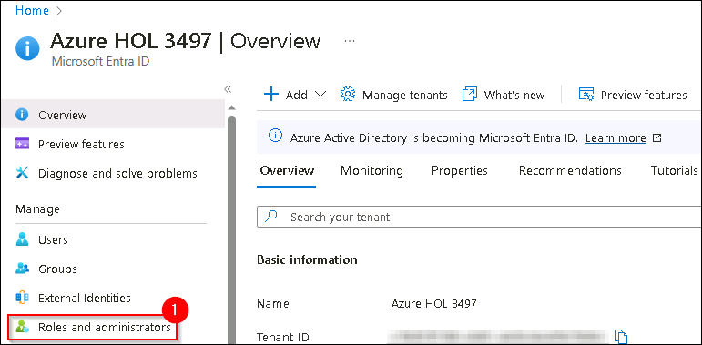
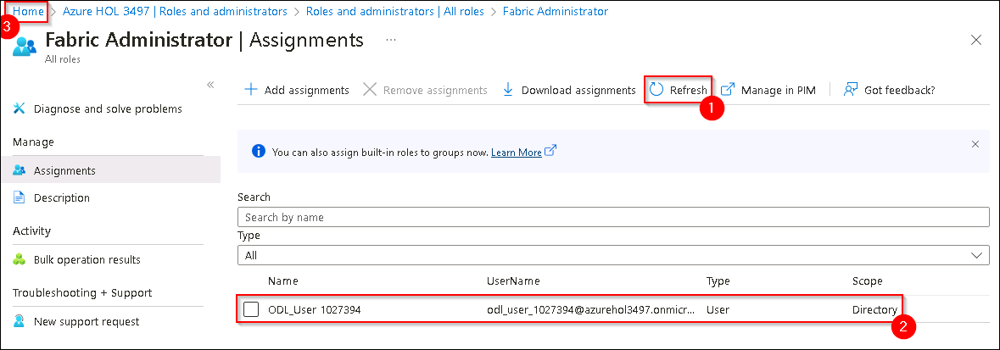
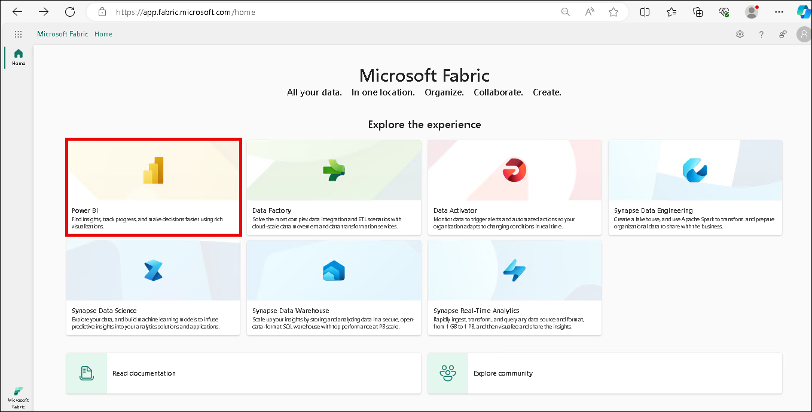
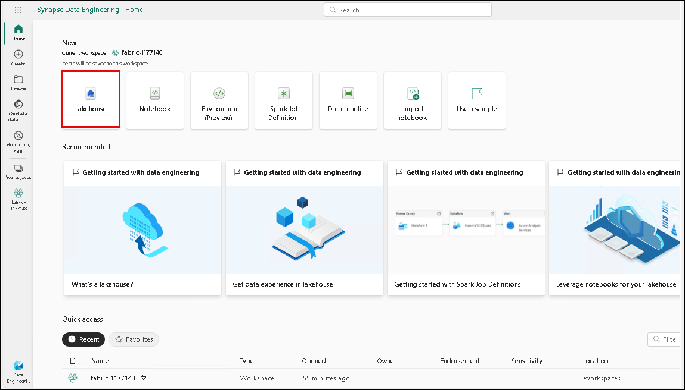
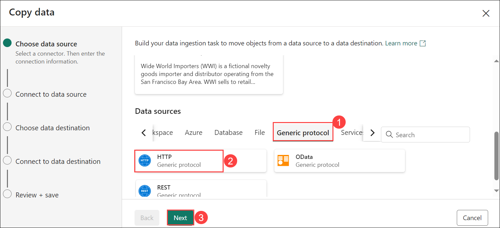
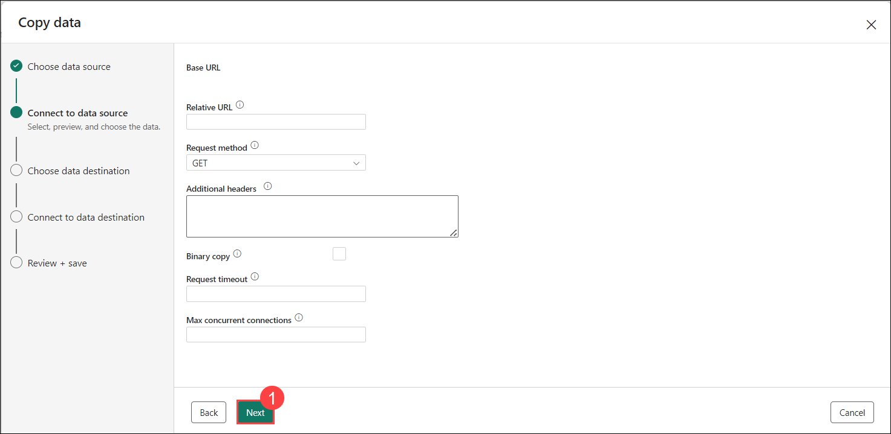
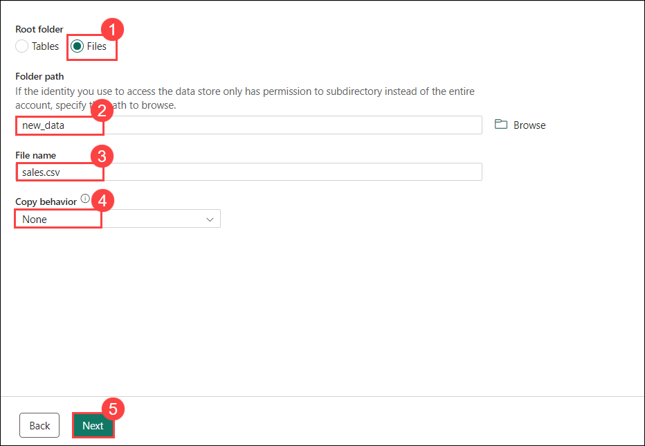
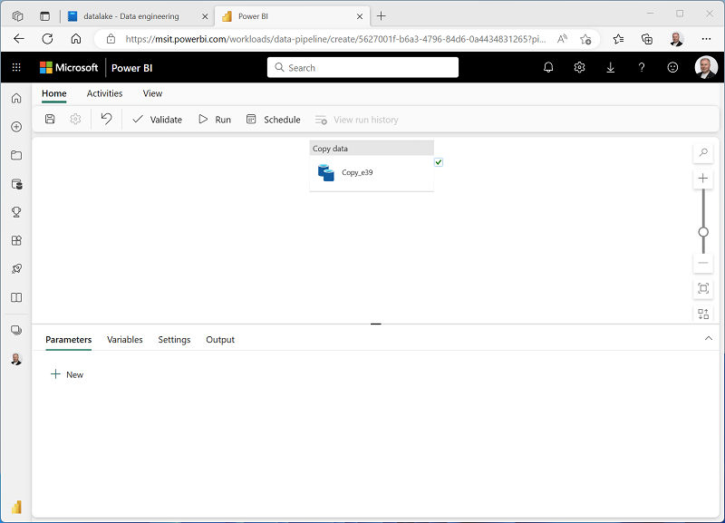

# Lab 01: Getting Started with Microsoft Fabric

## Objectives
  
### Estimated timing: 60 minutes

## Exercise 1 : Create a Fabric workspace

#### Task 1.1: Assign Fabric Administrator Role

1. Start by searching for **Microsoft Entra ID** in the search pane in Azure portal:

   

2. Navigate to **Roles and administrators**:

   

3. In the **Roles and administrators** page, search for **Fabric Administrator**, and click on it:

   

4. This will take you to the **Fabric Administrator | Assignments** page where you will have to assign yourself the **Fabric Administrator role**. Now, click on **+ Add Assignments**:

   

5. Make sure to **check the box(1)** next to your username, confirm if it is **Selected(2)** and click on **Add(3)**:

   

6. You can confirm the **Fabric Administrator** role has been added successfully by **refreshing(1)** Fabric Administrators | Assignments page. After **confirming(2)** it has been added successfully, navigate back to **Home(3)**.

   

----


#### Task 1.2: Create a workspace

Here, you create a Fabric workspace. The workspace contains all the items needed for this lakehouse tutorial, which includes lakehouse, dataflows, Data Factory pipelines, the notebooks, Power BI datasets, and reports.

1. Copy the **microsoft fabric homepage link**, and open this link inside the VM in a new tab:

   ```
   https://app.fabric.microsoft.com/
   ```


2. Select **Power BI**.

   
   


3.  Now, select **Workspaces** and click on **+ New workspace**:

    

4. Fill out the **Create a workspace** form with the following details:

   - **Name:** Enter **fabric-<inject key="DeploymentID" enableCopy="false"/>**.
   

   

   - **Advanced:** Expand it and Under **License mode**, select **Fabric capacity(1)**.

5. Select on exisitng **Capacity(2)** then click on **Apply(3)** to create and open the workspace.

   

## Excerise 2 : Create a Lakehouse and upload files.
   
   In Microsoft Fabric, a lakehouse provides highly scalable file storage in a OneLake store (built on Azure Data Lake Store Gen2) with a metastore for relational objects such as tables 
   and views based on the open source Delta Lake table format. Delta Lake enables you to define a schema of tables in your lakehouse that you can query using SQL.
   Now that you have created a workspace in the previous step, it's time to switch to the Data engineering experience in the portal and create a data lakehouse into which you will 
   ingest data.

## Task 2.1 : Create a lakehouse.

1. At the bottom left of the Power BI portal, select the **Power BI** icon and switch to the **Data Engineering** experience.

   
   
2. In the **Data engineering** home page, create a new **Lakehouse**.

    - **Name:** Enter **Lakehouse_<inject key="DeploymentID" enableCopy="false"/>**.

   

    After a minute or so, a new lakehouse with no **Tables** or **Files** will be created.

3. On the **Lake view** tab in the pane on the left, in the **...** menu for the **Files** node, select **New subfolder** and create a subfolder named **new_data**.

   

### Task 2.2: Upload files through pipeline

A simple way to ingest data is to use a **Copy Data** activity in a pipeline to extract the data from a source and copy it to a file in the lakehouse.

1. On the **Home** page for your lakehouse, select **New Data pipeline**.

    

2. Create a new data pipeline named **Ingest Sales Data Pipeline**. 
   
   
   
3. If the **Copy Data** wizard doesn't open automatically, select **Copy Data** in the pipeline editor page.

   

4. In the **Copy Data** wizard, on the **Choose a data source** page, in the **data sources** section, select the **Generic protocol (1)** tab and then select **HTTP (2)**, click on **Next (3)**.

   

5. Select **Next** and then select **Create new connection** and enter the following settings for the connection to your data source:
    - **URL**: `https://raw.githubusercontent.com/MicrosoftLearning/dp-data/main/sales.csv`
    - **Connection**: Create new connection
    - **Connection name**: *Specify a unique name*
    - **Authentication kind**: Basic (*Leave the username and password blank*)
  
    
    
6. Select **Next**. Then ensure the following settings are selected:
    - **Relative URL**: *Leave blank*
    - **Request method**: GET
    - **Additional headers**: *Leave blank*
    - **Binary copy**: <u>Un</u>selected
    - **Request timeout**: *Leave blank*
    - **Max concurrent connections**: *Leave blank*
  
    
   
8. Select **Next**, and wait for the data to be sampled and then ensure that the following settings are selected:
    - **File format**: DelimitedText
    - **Column delimiter**: Comma (,)
    - **Row delimiter**: Line feed (\n)
    - **First row as header**: Selected
    - **Compression type**: Leave default
9. Select **Preview data** to see a sample of the data that will be ingested. Then close the data preview and select **Next**.

     

10. On the **Choose data destination** page, select your existing lakehouse. Then select **Next**.

     

     

12. Set the following data destination options, and then select **Next**:
    - **Root folder**: Files
    - **Folder path name**: new_data
    - **File name**: sales.csv
    - **Copy behavior**: Leave default
   
    

13. Set the following file format options and then select **Next**:
    - **File format**: DelimitedText
    - **Column delimiter**: Comma (,)
    - **Row delimiter**: Line feed (\n)
    - **Add header to file**: Selected
    - **Compression type**: Leave default
   
    

14. On the **Copy summary** page, review the details of your copy operation and then select **Review + Run**.

    A new pipeline containing a **Copy Data** activity is created, as shown here:

    

15. When the pipeline starts to run, you can monitor its status in the **Output** pane under the pipeline designer. Use the **&#8635;** (*Refresh*) icon to refresh the status, and wait until it has succeeded.

    

16. In the menu bar on the left, select your lakehouse.

17. On the **Home** page, in the **Lakehouse explorer** pane, expand **Files** and select the **new_data** folder to verify that the **sales.csv** file has been copied.

    

    **Congratulations!** You have successfully learnt to create a Fabric workspace.

   ## Proceed to next exercise
