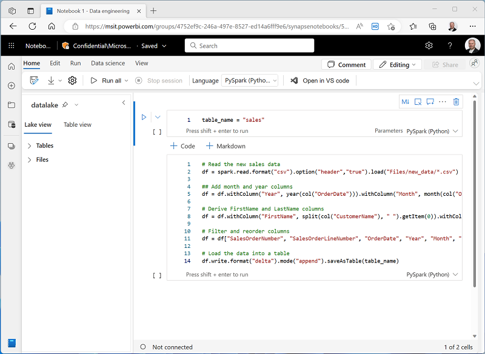
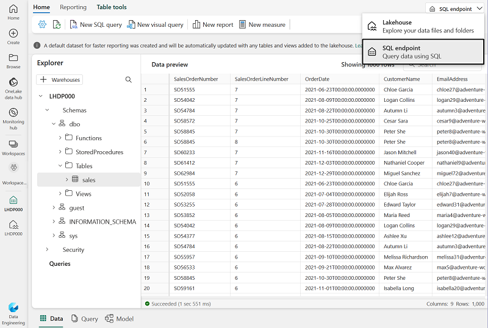
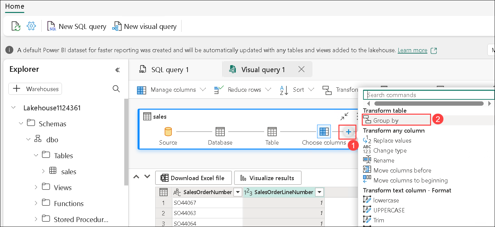
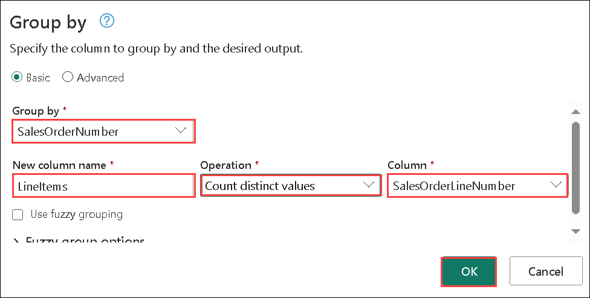
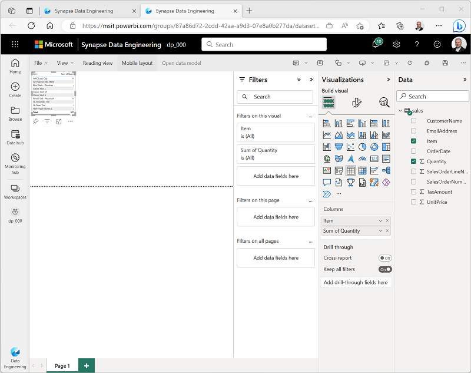

# Lab 02: Cloud-Scale-Analytics-with-Microsoft-Fabric

## Lab Scenario

## Objectives
  
### Estimated timing: 60 minutes

## Architecture Diagram

## Exercise 1 :Ingest data with a Microsoft Fabric Lakehouse 

#### Task 1 : Create a notebook

1. On the **Home** page for your lakehouse, in the **Open notebook** menu, select **New notebook**.

      

    After a few seconds, a new notebook containing a single *cell* will open. Notebooks are made up of one or more cells that can contain *code* or *markdown* (formatted text).

2. Select the existing cell in the notebook, which contains some simple code, and then replace the default code with the following variable declaration.

    ```python
   table_name = "sales"
    ```

    

3. In the **...** menu for the cell (at its top-right) select **Toggle parameter cell**. This configures the cell so that the variables declared in it are treated as parameters when running the notebook from a pipeline.

     

4. Under the parameters cell, use the **+ Code** button to add a new code cell. Then add the following code to it:

   >**Note:** Wait untill the previous code completes execution
   
    ```python
   from pyspark.sql.functions import *

   # Read the new sales data
   df = spark.read.format("csv").option("header","true").option("inferSchema","true").load("Files/new_data/*.csv")

   ## Add month and year columns
   df = df.withColumn("Year", year(col("OrderDate"))).withColumn("Month", month(col("OrderDate")))

   # Derive FirstName and LastName columns
   df = df.withColumn("FirstName", split(col("CustomerName"), " ").getItem(0)).withColumn("LastName", split(col("CustomerName"), " ").getItem(1))

   # Filter and reorder columns
   df = df["SalesOrderNumber", "SalesOrderLineNumber", "OrderDate", "Year", "Month", "FirstName", "LastName", "EmailAddress", "Item", "Quantity", "UnitPrice", "TaxAmount"]

   # Load the data into a managed table
   #Managed tables are tables for which both the schema metadata and the data files are managed by Fabric. The data files for the table are created in the Tables folder.
   df.write.format("delta").mode("append").saveAsTable(table_name)
    ```

    This code loads the data from the sales.csv file that was ingested by the **Copy Data** activity, applies some transformation logic, and saves the transformed data as a **managed table** - appending the data if the table already exists.

5. Verify that your notebooks looks similar to this, and then use the **&#9655; Run all** button on the toolbar to run all of the cells it contains.

    

    > **Note**: Since this is the first time you've run any Spark code in this session, the Spark pool must be started. This means that the first cell can take a minute or so to complete.

6. (Optional) You can also create **external tables** for which the schema metadata is defined in the metastore for the lakehouse, but the data files are stored in an external location.

    ```python
    df.write.format("delta").saveAsTable("external_sales", path="<abfs_path>/external_sales")

    #In the Lakehouse explorer pane, in the ... menu for the Files folder, select Copy ABFS path.

    #The ABFS path is the fully qualified path to the Files folder in the OneLake storage for your lakehouse - similar to this:

    #abfss://workspace@tenant-onelake.dfs.fabric.microsoft.com/lakehousename.Lakehouse/Files
    ```
    > **Note**: To run the above code, you need to replace the <abfs_path> with your abfs path


7. When the notebook run has completed, in the **Lakehouse explorer** pane on the left, in the **...** menu for **Tables** select **Refresh** and verify that a **sales** table has been created.

8. In the notebook menu bar, use the ⚙️ **Settings** icon to view the notebook settings. Then set the **Name** of the notebook to **Load Sales Notebook** and close the settings pane.

   
 
9. In the hub menu bar on the left, select your lakehouse.

10. In the **Explorer** pane, refresh the view. Then expand **Tables**, and select the **sales** table to see a preview of the data it contains.


## Task 2: Use SQL to query tables

When you create a lakehouse and define tables in it, a SQL endpoint is automatically created through which the tables can be queried using SQL `SELECT` statements.

1. At the top-right of the Lakehouse page, switch from **Lakehouse** to **SQL endpoint**. Then wait a short time until the SQL query endpoint for your lakehouse opens in a visual interface from which you can query its tables, as shown here:

    

2. Use the **New SQL query** button to open a new query editor, and enter the following SQL query:

    ```sql
   SELECT Item, SUM(Quantity * UnitPrice) AS Revenue
   FROM sales
   GROUP BY Item
   ORDER BY Revenue DESC;
    ```

3. Use the **&#9655; Run** button to run the query and view the results, which should show the total revenue for each product.

    

## Task 3 : Create a visual query

While many data professionals are familiar with SQL, data analysts with Power BI experience can apply their Power Query skills to create visual queries.

1. On the toolbar, select **New visual query**.

2. Drag the **sales** table to the new visual query editor pane that opens to create a Power Query as shown here: 

    

3. In the **Manage columns** menu, select **Choose columns**. Then select only the **SalesOrderNumber** and **SalesOrderLineNumber** columns.

    

4. Click on **+ (1)** ,in the **Transform table** menu, select **Group by (2)**.

    

5. Then group the data by using the following **Basic** settings:

    - **Group by**: SalesOrderNumber
    - **New column name**: LineItems
    - **Operation**: Count distinct values
    - **Column**: SalesOrderLineNumber

    

6. When you're done, the results pane under the visual query shows the number of line items for each sales order.

    

## Task 4 : Create a report

The tables in your lakehouse are automatically added to a default dataset that defines a data model for reporting with Power BI.

1. At the bottom of the SQL Endpoint page, select the **Model** tab. The data model schema for the dataset is shown.

    

    > **Note**: In this exercise, the data model consists of a single table. In a real-world scenario, you would likely create multiple tables in your lakehouse, each of which would be included in the model. You could then define relationships between these tables in the model.

2. In the menu ribbon, select the **Reporting** tab. Then select **New report**. A new browser tab opens in which you can design your report.

    

3. In the **Data** pane on the right, expand the **sales** table. Then select the following fields:
    - **Item**
    - **Quantity**

    A table visualization is added to the report:

    

4. Hide the **Data** and **Filters** panes to create more space. Then ensure the table visualization is selected and in the **Visualizations** pane, change the visualization to a **Clustered bar chart** and resize it as shown here.

    

5. On the **File** menu, select **Save**. Then save the report as **Item Sales Report** in the workspace you created previously.
6. Close the browser tab containing the report to return to the SQL endpoint for your lakehouse. Then, in the hub menu bar on the left, select your workspace to verify that it contains the following items:
    - Your lakehouse.
    - The SQL endpoint for your lakehouse.
    - A default dataset for the tables in your lakehouse.
    - The **Item Sales Report** report.


## Review

In this exercise, You've seen how a lakehouse consists of files and tables stored in a OneLake data store. The managed tables can be queried using SQL, and are included in a default dataset to support data visualizations.


## Proceed to next exercise
